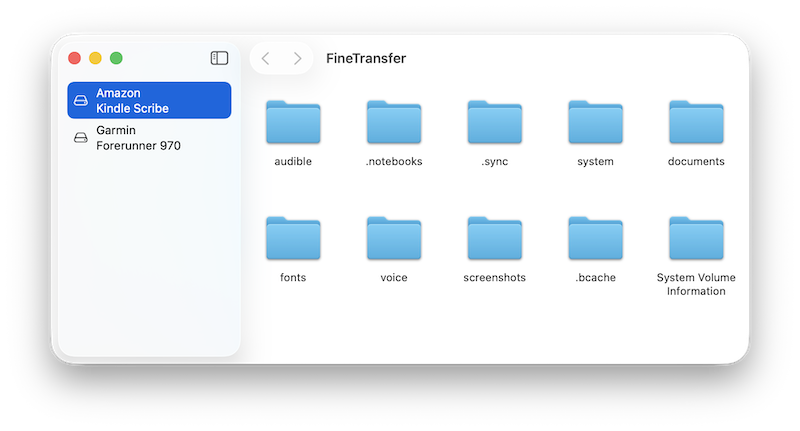

# FineTransfer

> **Note:** This is a personal hobby project. For more comprehensive and feature-rich MTP support on macOS, consider using mature alternatives like [OpenMTP](https://github.com/ganeshrvel/openmtp).

A macOS app for transferring files to/from MTP (Media Transfer Protocol) devices such as Android phones, Kindle e-Readers.



## Features

- **Native macOS interface** — Built with SwiftUI, following macOS design conventions
- **App Sandbox** — Only accesses files and paths explicitly chosen by the user, nothing else
- **No network connections** — Fully offline; no data is ever transmitted, keeping your files private

## Requirements

- macOS 26.0 or later
- Xcode 26 or later

## Building

Open `FineTransfer/FineTransfer.xcodeproj` in Xcode and build. The `MTP.xcodeproj` is referenced as a subproject and will build automatically.

Or use xcodebuild from the command line:

```bash
xcodebuild -project FineTransfer/FineTransfer.xcodeproj -scheme FineTransfer -configuration Release
```

## Dependencies

- [libmtp](http://libmtp.sourceforge.net/) — MTP protocol implementation (pre-compiled as `libmtp.a`)
- [libusb](https://libusb.info/) — USB access library (pre-compiled as `libusb-1.0.a`)
